# 📚 Tài Liệu Ôn Tập - Dự Án Quản Lý Vật Tư

> **Môn học:** Nguyên lý lập trình đối tượng  
> **Ngôn ngữ:** C++  
> **Mức độ:** Dành cho người mới bắt đầu

---

## 📋 Mục Lục

1. [Giới thiệu dự án](#1-giới-thiệu-dự-án)
2. [Cấu trúc dự án](#2-cấu-trúc-dự-án)
3. [Kiến thức cơ bản](#3-kiến-thức-cơ-bản)
4. [Phân tích chi tiết từng file](#4-phân-tích-chi-tiết-từng-file)
5. [Các chức năng chính](#5-các-chức-năng-chính)
6. [Sơ đồ luồng hoạt động](#6-sơ-đồ-luồng-hoạt-động)
7. [Tổng kết kiến thức](#7-tổng-kết-kiến-thức)

---

## 1. Giới Thiệu Dự Án

### 🎯 Mục tiêu

Dự án này giúp bạn học cách:
- **Sử dụng struct** để tổ chức dữ liệu
- **Quản lý mảng** (thêm, xóa, tìm kiếm, sắp xếp)
- **Tách code thành các hàm nhỏ** dễ hiểu và tái sử dụng
- **Tổ chức file** header (.h) và file nguồn (.cpp)

### 💡 Dự án làm gì?

Chương trình quản lý danh sách vật tư với các chức năng:
- Nhập/Xuất danh sách vật tư
- Tìm kiếm vật tư theo mã
- Sắp xếp danh sách
- Thêm/Xóa vật tư
- Thống kê theo đơn vị tính

---

## 2. Cấu Trúc Dự Án

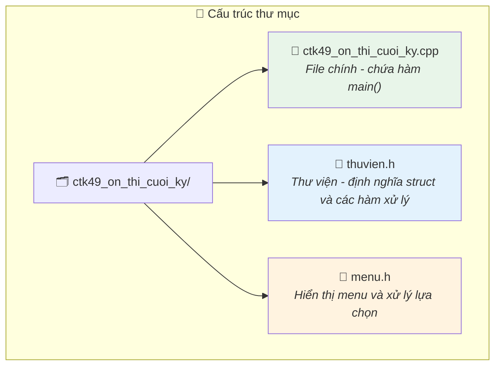

### Mối quan hệ giữa các file

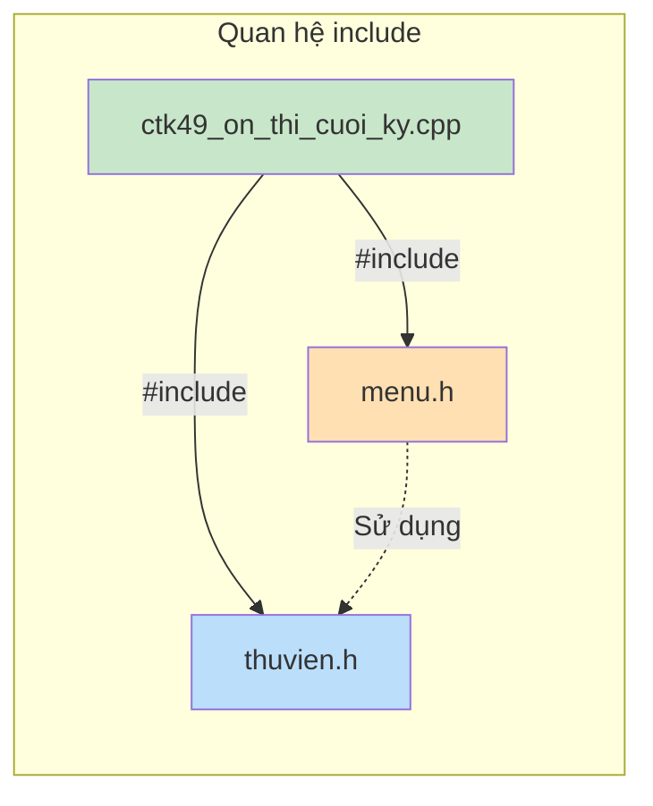

> **💡 Giải thích đơn giản:**
> - File `.cpp` là file **chương trình chính**
> - File `.h` (header) là file **thư viện** chứa các hàm và cấu trúc dữ liệu
> - `#include` giống như việc **mượn sách từ thư viện** để sử dụng

---

## 3. Kiến Thức Cơ Bản

### 3.1 Struct là gì?

**Struct** (cấu trúc) giúp bạn **gộp nhiều thông tin liên quan vào một "gói"**.

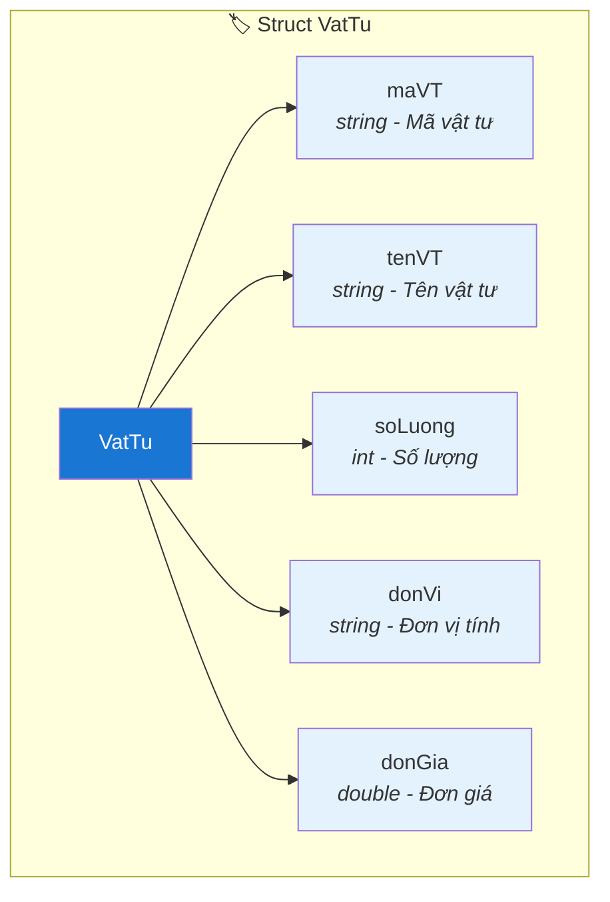

**Code tương ứng:**

```cpp
struct VatTu
{
    string maVT;     // Mã vật tư, ví dụ: "VT001"
    string tenVT;    // Tên vật tư, ví dụ: "Gạo"
    int soLuong;     // Số lượng, ví dụ: 100
    string donVi;    // Đơn vị tính, ví dụ: "kg"
    double donGia;   // Đơn giá, ví dụ: 15000.0
};
```

> **💡 Ví dụ thực tế:**  
> Thay vì viết 5 biến riêng lẻ cho mỗi vật tư, ta gộp chúng vào 1 struct.  
> Giống như **thẻ căn cước** gộp tất cả thông tin của bạn vào một thẻ!

---

### 3.2 Typedef là gì?

```cpp
typedef VatTu DanhSachVatTu[MAX];  // MAX = 100
```

**Giải thích:**
- `typedef` giúp **đặt tên mới** cho kiểu dữ liệu phức tạp
- `DanhSachVatTu` bây giờ là tên gọi của "mảng 100 phần tử VatTu"
- Thay vì viết `VatTu ds[100]`, ta viết ngắn gọn `DanhSachVatTu ds`

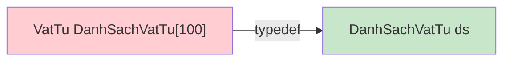

---

### 3.3 Tham chiếu (Reference) với dấu &

Trong C++, dấu `&` trong tham số hàm có nghĩa là **tham chiếu** - thay đổi trực tiếp biến gốc.

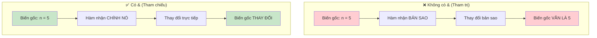

**Ví dụ trong code:**

```cpp
// Có dấu & → thay đổi n gốc
void NhapDanhSachVatTu(DanhSachVatTu ds, int& n);

// Có dấu & → thay đổi vt gốc
void NhapMotVatTu(VatTu& vt);
```

---

## 4. Phân Tích Chi Tiết Từng File

### 4.1 File `thuvien.h` - Thư Viện Chính

File này chứa **toàn bộ logic xử lý dữ liệu** của chương trình.

#### 📦 Các thư viện sử dụng

```cpp
#include <iomanip>   // Định dạng xuất (căn lề, độ rộng)
#include <ios>       // Điều khiển xuất/nhập
#include <iostream>  // Xuất/nhập cơ bản (cout, cin)
```

#### 🔢 Hằng số

```cpp
#define MAX 100      // Số vật tư tối đa
#define TAB '\t'     // Ký tự tab
```

#### 📊 Danh sách các hàm

| Hàm | Chức năng | Loại |
|-----|-----------|------|
| `NhapMotVatTu` | Nhập thông tin 1 vật tư | Nhập liệu |
| `NhapDanhSachVatTu` | Nhập danh sách vật tư | Nhập liệu |
| `XuatMotVatTu` | Xuất thông tin 1 vật tư | Xuất liệu |
| `XuatDanhSachVatTu` | Xuất danh sách vật tư | Xuất liệu |
| `TinhTongGia` | Tính tổng giá theo điều kiện | Tính toán |
| `TimViTriVatTu` | Tìm vị trí vật tư theo mã | Tìm kiếm |
| `SapXepDanhSachVatTu` | Sắp xếp danh sách | Sắp xếp |
| `HoanVi` | Hoán đổi 2 vật tư | Hỗ trợ |
| `Xoa1VatTu` | Xóa 1 vật tư tại vị trí | Xóa |
| `XoaVatTu` | Xóa vật tư theo điều kiện | Xóa |
| `ChenVatTu` | Chèn vật tư mới | Thêm |
| `InBangThongKe` | Thống kê theo đơn vị | Thống kê |

---

### 4.2 File `menu.h` - Xử Lý Menu

File này xử lý **giao diện người dùng**.

#### 📊 Danh sách các hàm

| Hàm | Chức năng |
|-----|-----------|
| `XuatMenu()` | Hiển thị menu các chức năng |
| `ChonMenu(int soMenu)` | Nhận lựa chọn từ người dùng |
| `XuLyMenu(int menu, ...)` | Thực thi chức năng đã chọn |
| `ChayChuongTrinh(...)` | Vòng lặp chính của chương trình |

---

### 4.3 File `ctk49_on_thi_cuoi_ky.cpp` - Hàm Main

```cpp
int main()
{
    // Khai báo danh sách vật tư với dữ liệu mẫu
    DanhSachVatTu ds = {
        {"VT001", "Vat tu 1", 10, "kg", 10000},
        {"VT002", "Vat tu 2", 20, "kg", 20000},
        // ...
    };

    int n = 5;  // Số lượng vật tư hiện tại
    
    ChayChuongTrinh(ds, n);  // Bắt đầu chương trình

    return 1;
}
```

> **💡 Giải thích:**  
> File này chỉ làm 2 việc:
> 1. **Khởi tạo dữ liệu mẫu** (5 vật tư)
> 2. **Gọi hàm chạy chương trình** từ menu.h

---

## 5. Các Chức Năng Chính

### 5.1 Nhập vật tư

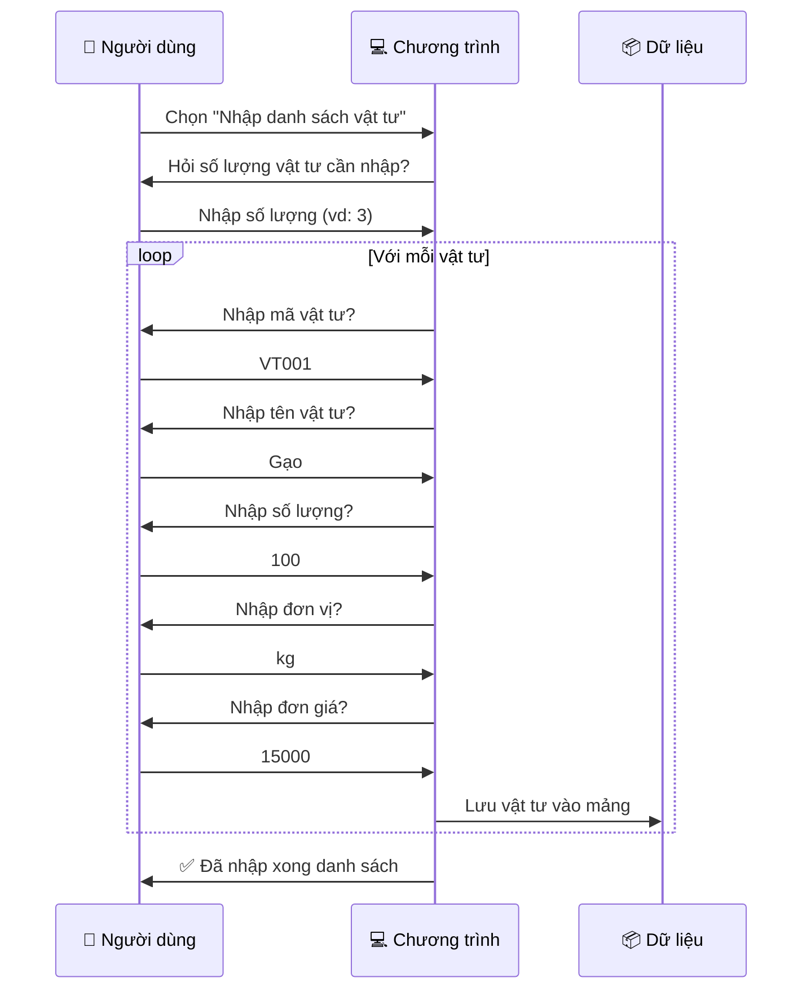

**Code minh họa:**

```cpp
void NhapMotVatTu(VatTu& vt)
{
    cout << "Nhap ma vat tu: ";   cin >> vt.maVT;
    cout << "Nhap ten vat tu: ";  cin >> vt.tenVT;
    cout << "Nhap so luong: ";    cin >> vt.soLuong;
    cout << "Nhap don vi: ";      cin >> vt.donVi;
    cout << "Nhap don gia: ";     cin >> vt.donGia;
}
```

---

### 5.2 Xuất danh sách

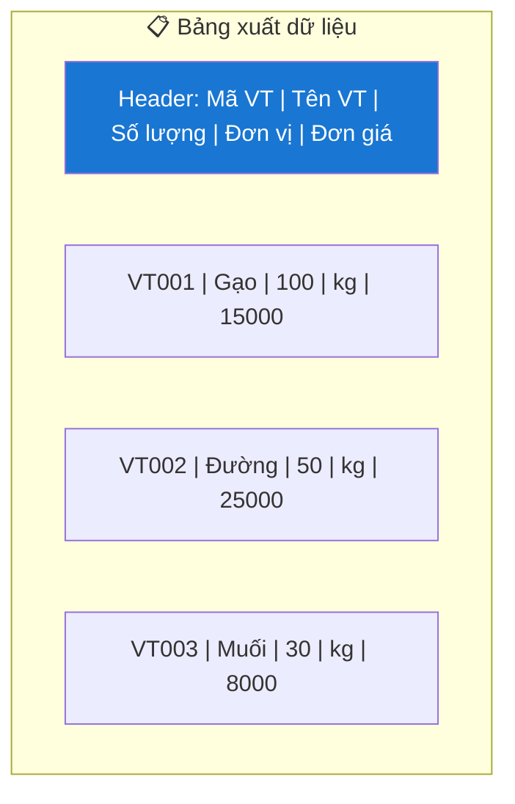

**Code minh họa:**

```cpp
void XuatDanhSachVatTu(DanhSachVatTu ds, int n)
{
    XuatDongTieuDe();    // In tiêu đề bảng
    XuatDongKeNgang();   // In đường kẻ
    
    for (int i = 0; i < n; i++)
    {
        XuatMotVatTu(ds[i]);  // In từng vật tư
    }
    
    XuatDongKeNgang();   // In đường kẻ cuối
}
```

---

### 5.3 Tìm kiếm vật tư

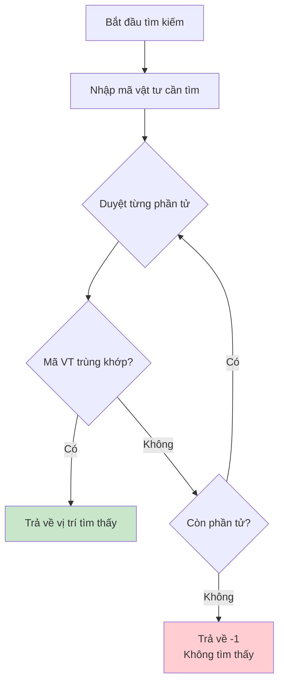

**Code minh họa:**

```cpp
int TimViTriVatTu(DanhSachVatTu ds, int n, string maVT)
{
    for (int i = 0; i < n; i++)
    {
        if (ds[i].maVT == maVT)  // So sánh mã
        {
            return i;  // Tìm thấy → trả vị trí
        }
    }
    return -1;  // Không tìm thấy
}
```

> **💡 Lưu ý:**  
> Hàm trả về `-1` khi không tìm thấy là **quy ước phổ biến** trong lập trình.

---

### 5.4 Sắp xếp danh sách

Thuật toán sử dụng: **Interchange Sort** (Sắp xếp đổi chỗ)

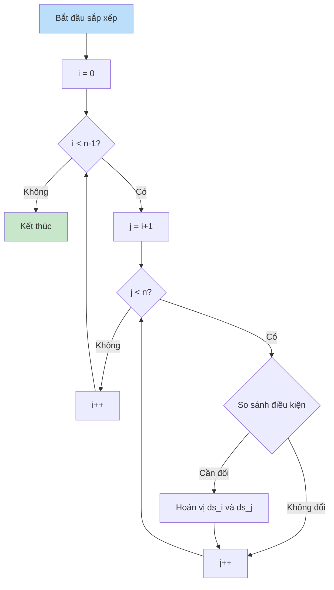

**Điều kiện sắp xếp:**
1. **Giảm theo đơn vị tính** (A-Z → Z-A)
2. **Nếu cùng đơn vị** → Tăng theo số lượng

```cpp
void SapXepDanhSachVatTu(DanhSachVatTu ds, int n)
{
    for (int i = 0; i < n - 1; i++)
    {
        for (int j = i + 1; j < n; j++)
        {
            // Điều kiện 1: Sắp giảm theo đơn vị
            bool dieuKien1 = ds[i].donVi < ds[j].donVi;
            
            // Điều kiện 2: Cùng đơn vị thì sắp tăng số lượng
            bool dieuKien2 = ds[i].donVi == ds[j].donVi 
                          && ds[i].soLuong > ds[j].soLuong;

            if (dieuKien1 || dieuKien2)
            {
                HoanVi(ds[i], ds[j]);  // Đổi chỗ
            }
        }
    }
}
```

---

### 5.5 Xóa vật tư

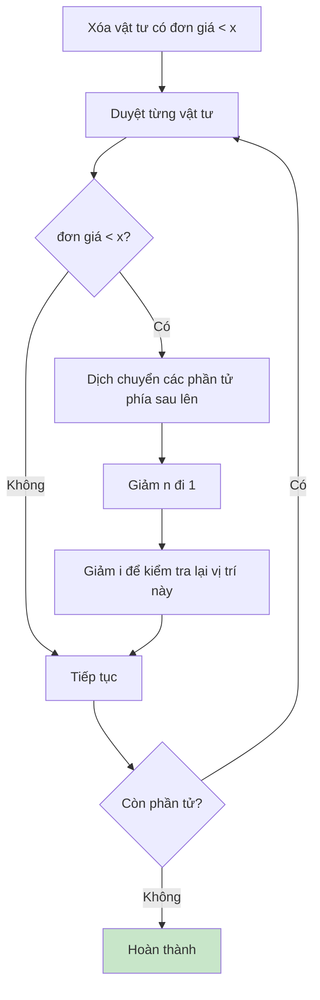

**Code minh họa:**

```cpp
// Xóa 1 vật tư tại vị trí cụ thể
void Xoa1VatTu(DanhSachVatTu ds, int& n, int viTri)
{
    // Dịch chuyển các phần tử phía sau lên
    for (int i = viTri; i < n - 1; i++)
    {
        ds[i] = ds[i + 1];
    }
    n--;  // Giảm số lượng
}

// Xóa tất cả vật tư có đơn giá < x
void XoaVatTu(DanhSachVatTu ds, int& n, double x)
{
    for (int i = 0; i < n; i++)
    {
        if (ds[i].donGia < x)
        {
            Xoa1VatTu(ds, n, i);
            i--;  // ⚠️ Quan trọng: kiểm tra lại vị trí này
        }
    }
}
```

> **⚠️ Lưu ý quan trọng:**  
> Khi xóa phần tử, phải `i--` để kiểm tra lại vị trí vừa dịch chuyển lên!

---

### 5.6 Chèn vật tư

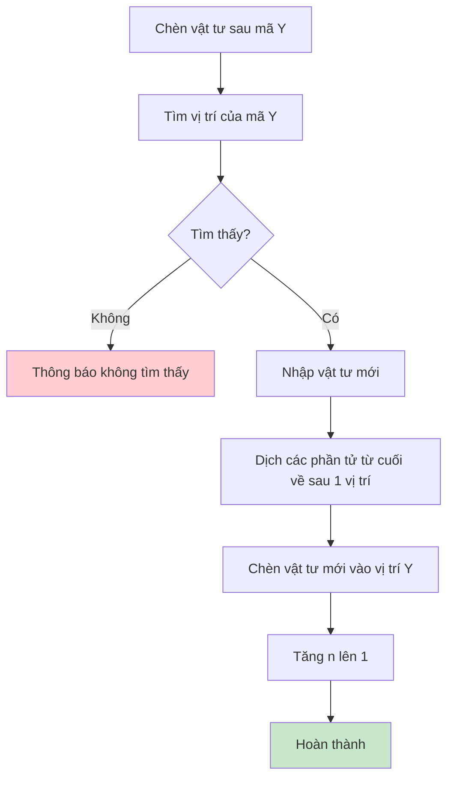

**Code minh họa:**

```cpp
void ChenVatTu(DanhSachVatTu ds, int& n, string maVT)
{
    // Bước 1: Tìm vị trí chèn
    int viTri = TimViTriVatTu(ds, n, maVT);
    if (viTri == -1)
    {
        cout << "Khong tim thay vat tu co ma " << maVT;
        return;
    }

    // Bước 2: Nhập vật tư mới
    VatTu vt;
    NhapMotVatTu(vt);

    // Bước 3: Dịch chuyển các phần tử về sau
    for (int i = n; i > viTri; i--)
    {
        ds[i] = ds[i - 1];
    }

    // Bước 4: Chèn vào vị trí
    ds[viTri] = vt;
    n++;
}
```

---

### 5.7 Thống kê theo đơn vị

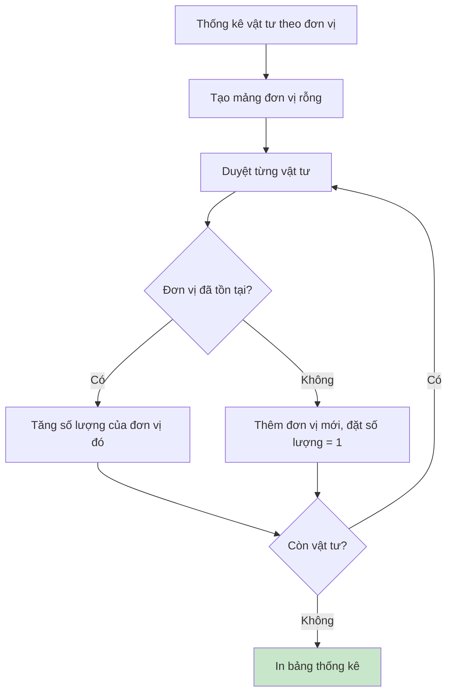

**Kết quả mẫu:**

```
========== THONG KE VAT TU THEO DON VI TINH ==========
----------------------------------------
Don vi tinh         So luong vat tu     
----------------------------------------
kg                  5                   
----------------------------------------
Tong cong: 1 loai don vi, 5 vat tu.
```

---

## 6. Sơ Đồ Luồng Hoạt Động

### Luồng chương trình chính

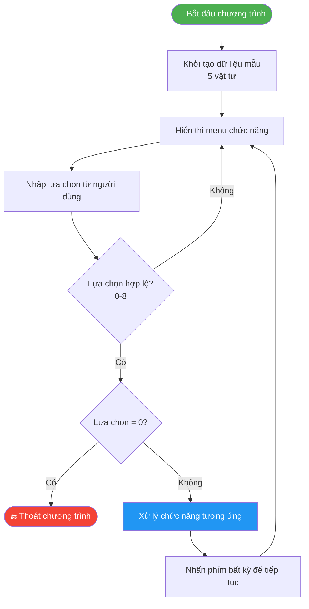

### Menu chức năng

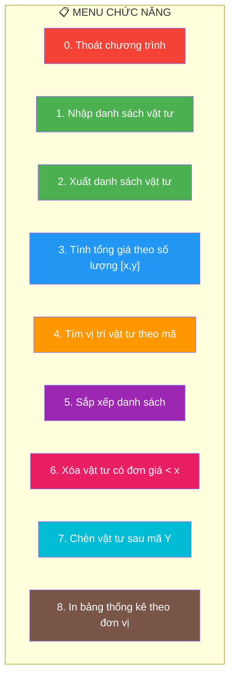

---

## 7. Tổng Kết Kiến Thức

### 📚 Các khái niệm đã học

| Khái niệm | Mô tả | Ví dụ trong dự án |
|-----------|-------|-------------------|
| **Struct** | Gộp nhiều biến liên quan | `struct VatTu` |
| **Typedef** | Đặt tên mới cho kiểu dữ liệu | `typedef VatTu DanhSachVatTu[MAX]` |
| **Mảng** | Lưu trữ nhiều phần tử cùng kiểu | `DanhSachVatTu ds` |
| **Tham chiếu (&)** | Thay đổi biến gốc trong hàm | `void NhapMotVatTu(VatTu& vt)` |
| **Hàm** | Tách code thành các khối nhỏ | `NhapMotVatTu()`, `XuatMotVatTu()` |
| **Vòng lặp for** | Duyệt qua mảng | `for (int i = 0; i < n; i++)` |
| **Câu lệnh switch** | Xử lý nhiều trường hợp | `switch(menu)` trong `XuLyMenu()` |

---

### 🎯 Các thao tác với mảng

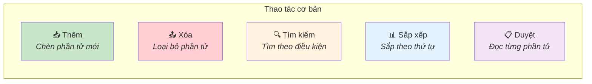

---

### ✅ Checklist ôn tập

- [ ] Hiểu cách khai báo và sử dụng **struct**
- [ ] Biết cách truyền tham số **tham chiếu (&)**
- [ ] Nắm vững các thao tác trên **mảng** (thêm, xóa, duyệt)
- [ ] Hiểu thuật toán **tìm kiếm tuần tự**
- [ ] Hiểu thuật toán **sắp xếp Interchange Sort**
- [ ] Biết cách **tách code thành các hàm** nhỏ
- [ ] Hiểu cấu trúc **file header (.h)** và **file nguồn (.cpp)**

---

### 📝 Bài tập tự luyện

1. **Thêm chức năng mới:** Tìm vật tư có đơn giá cao nhất
2. **Sửa đổi sắp xếp:** Sắp xếp tăng theo đơn giá
3. **Thêm validation:** Kiểm tra mã vật tư không được trùng khi nhập
4. **Mở rộng thống kê:** Tính tổng giá trị của từng loại đơn vị

---

> **📌 Lời khuyên:**  
> Hãy tự gõ lại code từ đầu (không copy-paste) để hiểu sâu hơn về cách hoạt động của chương trình. Thử thay đổi và chạy thử để xem kết quả!

---

*Tài liệu được tạo để hỗ trợ ôn tập môn Nguyên lý lập trình đối tượng* 📚
